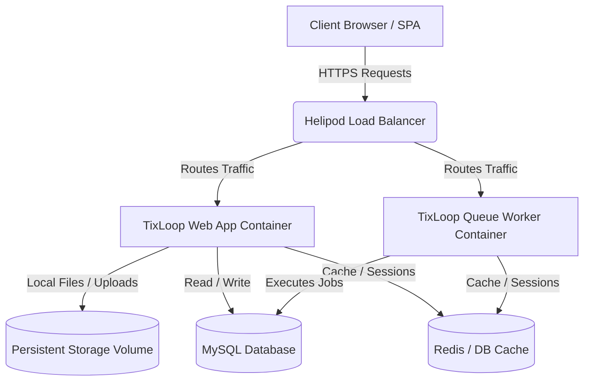

# Deployment Readiness Audit

- **Date**: 2026-06-04
- **Branch**: `chore/deployment-readiness`
- **Target Environment**: Helipod.io (PaaS), MySQL, Sanctum, Laravel 12 (Local: Laravel 13)

This document provides a comprehensive deployment readiness audit for the TixLoop backend application. It analyzes the application's configuration, databases, storage, security settings, and containerization requirements to ensure a seamless production deployment on Helipod.io.

---

## 1. System Architecture Overview

The following diagram illustrates how the TixLoop application components interact when deployed in the Helipod.io PaaS environment:



---

## 2. Deployment Checklist

| Task Category | Action Item | Command / Details | Status |
| :--- | :--- | :--- | :--- |
| **Security** | Generate production application key | `php artisan key:generate --show` (save to env) | ⚠️ Pending |
| **Security** | Disable debug mode | Set `APP_DEBUG=false` | ⚠️ Pending |
| **Security** | Enforce HTTPS | Enable secure cookies and trust proxies | ⚠️ Pending |
| **Database** | Run database migrations safely | `php artisan migrate --force` | ⚠️ Pending |
| **Database** | Verify seeder idempotency | Do not run dev seeders in production | ⚠️ Pending |
| **Storage** | Mount persistent volume | Map `/var/www/html/storage/app` | ⚠️ Pending |
| **Storage** | Create public symbolic link | `php artisan storage:link` | ⚠️ Pending |
| **Optimization**| Cache configuration | `php artisan config:cache` | ⚠️ Pending |
| **Optimization**| Cache routes | `php artisan route:cache` | ⚠️ Pending |
| **Optimization**| Cache views | `php artisan view:cache` | ⚠️ Pending |
| **Queue** | Configure process monitor | Setup background worker for `queue:work` | ⚠️ Pending |

---

## 3. Required Environment Variables

These variables must be populated in the Helipod.io dashboard configuration panel before triggering the build process.

### Core Settings
```ini
APP_NAME=TixLoop
APP_ENV=production
APP_DEBUG=false
APP_KEY=base64:... # Must be generated securely
APP_URL=https://api.tixloop.com # Replace with production domain
```

### Database (MySQL)
```ini
DB_CONNECTION=mysql
DB_HOST=127.0.0.1 # Provide Helipod MySQL internal host
DB_PORT=3306
DB_DATABASE=tixloop_prod
DB_USERNAME=tixloop_user
DB_PASSWORD=your_secure_password
```

### Session & Cache Configuration
```ini
# Recommended: Use redis or cookie session to avoid ULID schema conflict on database sessions
SESSION_DRIVER=cookie 
SESSION_LIFETIME=120
SESSION_SECURE_COOKIE=true

# Cache Store settings
CACHE_STORE=database
DB_CACHE_TABLE=cache

# Queue Settings
QUEUE_CONNECTION=database # Runs queue via 'jobs' table
```

### Sanctum & CORS Settings
```ini
# Domains allowed to authenticate using first-party stateful cookies
SANCTUM_STATEFUL_DOMAINS=tixloop.com,app.tixloop.com

# Token prefix for secret scanning safety
SANCTUM_TOKEN_PREFIX=txlp_
```

---

## 4. Storage Configuration

Laravel uses the `storage/` directory for multiple operations including file uploads, logs, session data, and application cache. In a PaaS container environment like Helipod.io, container filesystems are ephemeral.

### Critical Storage Requirements:
1. **Ephemeral Filesystem Danger**: 
   In `TicketService.php`, ticket proofs are explicitly saved using the `'local'` disk:
   ```php
   $proofPath = $ticketProof->store('ticket_proofs', 'local');
   ```
   This disk resolves to `storage/app/private`. Without persistent mounting, all user-uploaded ticket proofs will be **deleted** whenever the container restarts or redeploys.
2. **Mount Points**:
   A persistent volume mount must be created in Helipod mapping `/var/www/html/storage/app`.
3. **Symbolic Links**:
   The post-deployment script must execute `php artisan storage:link` to enable access to public assets stored in `storage/app/public`.

---

## 5. Session, Cache, and Queue Requirements

### Session Driver
* **Current Config**: `SESSION_DRIVER=database` is defined in `.env.example`.
* **ULID Conflict**: 
  The `sessions` table migration defines:
  ```php
  $table->foreignId('user_id')->nullable()->index();
  ```
  However, the `users` table uses **ULID** primary keys (`$table->ulid('id')->primary()`). Attempting to insert a ULID string into a BigInt `user_id` column will fail or truncate in MySQL.
* **Resolution**: Change `SESSION_DRIVER=cookie` (safer, stateless API approach) or `SESSION_DRIVER=redis`. If database sessions are required, the migration must be updated to use a string/char column: `$table->string('user_id', 26)->nullable()->index()`.

### Cache Driver
* **Configured Store**: `CACHE_STORE=database` (uses `cache` table).
* **Multi-Instance Safety**: Database cache is safe for horizontal scaling. However, if traffic scales up, switching to Redis (`CACHE_STORE=redis`) is highly recommended to offload the relational database.

### Queue Driver
* **Configured Store**: `QUEUE_CONNECTION=database`.
* **Execution requirement**: Jobs (e.g. ticket transfers, notifications) will sit in the `jobs` table unless a worker processes them.
* **Helipod Setup**: Define a separate background worker service running:
  ```bash
  php artisan queue:work --tries=3 --timeout=90
  ```

---

## 6. Sanctum & CORS Configuration

### Sanctum Compatibility
* **ULID Support**: The `personal_access_tokens` table migration has been successfully updated:
  ```php
  $table->ulidMorphs('tokenable');
  ```
  This is fully compatible with the ULID-based `User` model.
* **Security Recommendation**: Token expiration defaults to `null` (never expires). Set a token lifespan in `config/sanctum.php` for production:
  ```php
  'expiration' => 1440, // 24 hours (in minutes)
  ```

### CORS Configuration
* **Laravel 12/13 Defaults**: CORS is managed globally via the `HandleCors` middleware.
* **Stateful Credentials**: To allow SPA authentication, ensure credentials support is enabled. Run the publish command:
  ```bash
  php artisan config:publish cors
  ```
  Verify that `config/cors.php` contains:
  ```php
  'paths' => ['api/*', 'sanctum/csrf-cookie'],
  'allowed_origins' => ['https://app.tixloop.com'], # Set exact frontend URL
  'supports_credentials' => true,
  ```

---

## 7. Seeder Strategy

The existing seeders in the `database/seeders/` directory are designed for development and testing. They are **not idempotent** and will crash if executed on an existing database due to unique constraint violations.

### Issues Identified:
* **`RoleSeeder.php`**: Uses `Role::create(['name' => $role])` directly. If roles exist, it throws an error.
* **`UserSeeder.php`**: Uses `User::create([...])` with hardcoded emails. It will crash on duplicate entries.
* **`DatabaseSeeder.php`**: Automatically calls `RoleSeeder`, `EventSeeder`, `UserSeeder`, and `DemoSeeder`.

### Production Seeding Rules:
1. **Never run `db:seed` in Production**: Dev seeders inject mock data and users that should not exist in production.
2. **Create a Production Seeder**: If core lookup data (like roles) needs to be seeded, use `firstOrCreate` logic:
   ```php
   Role::firstOrCreate(['name' => 'admin']);
   ```
3. Run the targeted production seeder explicitly:
   ```bash
   php artisan db:seed --class=ProductionSeeder --force
   ```

---

## 8. CI/CD Readiness

There is currently no CI/CD workflow defined in the codebase. To automate checks and guarantee deployment stability, implement a GitHub Actions pipeline.

### Recommended Pipeline Steps (`.github/workflows/deploy.yml`):
1. **Linter & Code Style Check**: Validate code alignment with Pint:
   ```bash
   vendor/bin/pint --test
   ```
2. **Automated Testing**: Run feature and unit tests using the SQLite in-memory configuration:
   ```bash
   php artisan test --parallel
   ```
3. **Deployment Trigger**: If tests pass, trigger a Git push or deploy webhook to Helipod.io.

---

## 9. Production Risks & Mitigation

> [!WARNING]
> **Risk 1: Hardcoded Local Filesystem Disk**
> * **Details**: The backend hardcodes the `'local'` disk for ticket proof storage inside `TicketService.php`.
> * **Mitigation**: A persistent directory mount mapping `/var/www/html/storage/app/private` must be configured in Helipod.io.

> [!CAUTION]
> **Risk 2: Database Session Driver ULID Mismatch**
> * **Details**: The `sessions` table uses a BigInt foreign key (`user_id`), but the `users` table uses a string-based `ULID`. This causes crashes when inserting user sessions.
> * **Mitigation**: Switch to `SESSION_DRIVER=cookie` (stateless client session) or `SESSION_DRIVER=redis`, or write a migration modifying `sessions.user_id` to `VARCHAR(26)`.

> [!IMPORTANT]
> **Risk 3: Laravel Version Skew (Laravel 13 vs 12)**
> * **Details**: The target environment is specified as **Laravel 12**, but the codebase `composer.json` requires `laravel/framework: ^13.8` (Laravel 13).
> * **Mitigation**: Ensure the Helipod runtime executes PHP 8.2+ and supports Laravel 13 dependencies. Do not deploy Laravel 13 code to a Laravel 12 runtime.

> [!NOTE]
> **Risk 4: Dev Seeders Crash Risk**
> * **Details**: Seeding in production with the default configuration will fail and taint the database with dummy user records.
> * **Mitigation**: Restrict production seeding strictly to administrative roles and static constants using idempotent methods (`firstOrCreate`).

---

## 10. Pre-Deployment Validation Commands

Before triggering the deployment build, execute these commands locally or in a staging environment to verify configuration integrity:

### 1. Run Automated Test Suite
```powershell
php artisan test --compact
```
*(Confirms that all 122 tests pass successfully with no regression)*

### 2. Verify Linting and Code Styling
```powershell
vendor/bin/pint --test
```
*(Ensures style compliance prior to branch merge)*

### 3. Validate Configuration Cache Build
```powershell
php artisan config:cache
php artisan route:cache
php artisan view:cache
```
*(Verifies that no closures are used in routes/configs, which would break serialization in production)*

### 4. Check Migration Status
```powershell
php artisan migrate:status
```
*(Confirms all schema updates are accounted for)*
