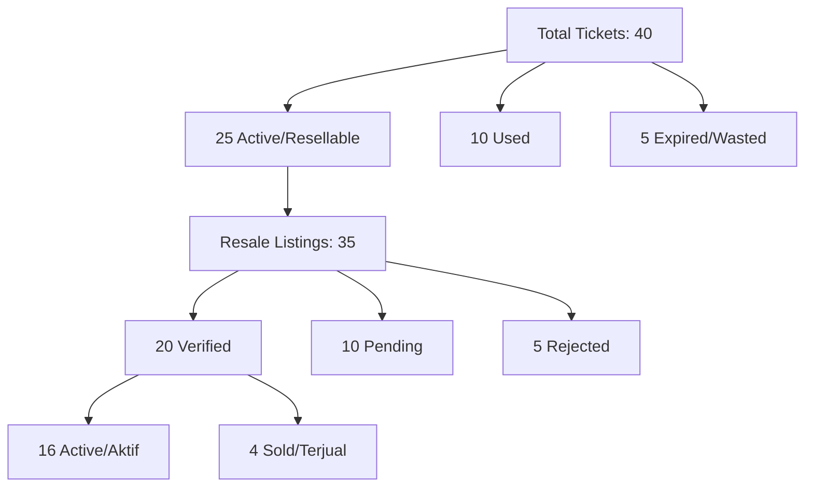
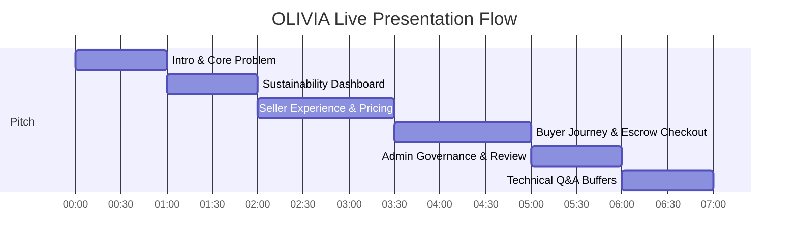

# TixLoop Frontend Demo Integration & Persona Guide

This document is the official frontend integration and demo execution guide. It provides step-by-step instructions, persona accounts, seeded data states, and API endpoints to verify the TixLoop implementation in a live presentation.

---

## 1. Demo Personas & Credentials
All seeded users share the same default password: **`password`**

| Persona Name | Email | Role(s) | Role & Presentation Focus |
| :--- | :--- | :--- | :--- |
| **Admin Verifikator** | `admin@tixloop.com` | `admin` | **Manual Quality Assurance**: Reviews incoming reseller tickets, inspects proofs, approves, or rejects. |
| **Budi Santoso** | `student.seller@tixloop.com` | `seller` | **High-Urgency Seller**: Student trying to offload tickets quickly. Subject to TTE burn prevention warnings. |
| **Rian Hidayat** | `music.enthusiast@tixloop.com` | `seller`, `buyer` | **Active Power User**: Frequently resells and buys tickets. Has active listings and pending checkouts. |
| **Siti Rahma** | `concert.hunter@tixloop.com` | `buyer` | **Deal Hunter**: Scours the marketplace for last-minute listings and prices near the floor. |
| **Diana Putri** | `event.collector@tixloop.com` | `buyer` | **High-Intent Buyer**: Purchases tickets early for high-demand sports and festivals. |

---

## 2. User Demo Flows

### Admin Demo Flow: Ticket Verification & Governance
This flow demonstrates the admin vetting process, ensuring that only verified, legitimate tickets enter the secondary market.

1. **Login as Admin**:
   * **Endpoint**: `POST /api/v1/auth/login`
   * **Payload**:
     ```json
     {
       "email": "admin@tixloop.com",
       "password": "password"
     }
     ```
   * **Action**: Capture the returned `access_token` and append it as `Bearer <token>` to subsequent headers.

2. **Open Verification Dashboard**:
   * **Endpoint**: `GET /api/v1/admin/listings`
   * **Action**: Displays all pending ticket listings requiring review.
   * **Seeded Data**: You will see listings like:
     * **Coldplay Ticket 3** (`01h35p38c4b140432eb162c783`) owned by Rian Hidayat.
     * **DWP Ticket 1** (`01h35p38c4b140432eb162c784`) owned by Budi Santoso.
     * 8 other factory-seeded pending listings.

3. **Approve Listing**:
   * **Action**: Inspect the listing for DWP Ticket 1 (`01h35p38c4b140432eb162c784`).
   * **Endpoint**: `POST /api/v1/admin/listings/01h35p38c4b140432eb162c784/verify`
   * **Payload**: None (authorized via Sanctum + admin policy).
   * **Result (HTTP 200)**: Verification status updates to `verified` and `listed_at` is set. The ticket becomes visible on the public marketplace.

4. **Reject Listing**:
   * **Action**: Inspect the listing for Coldplay Ticket 3 (`01h35p38c4b140432eb162c783`).
   * **Endpoint**: `POST /api/v1/admin/listings/01h35p38c4b140432eb162c783/reject`
   * **Payload**:
     ```json
     {
       "rejection_reason": "Ticket verification proof contains mismatched serial numbers."
     }
     ```
   * **Result (HTTP 200)**: Verification status updates to `rejected` and the listing status transitions to `ditangguhkan` (suspended). It will not appear on the marketplace.

---

### Seller Demo Flow: Burn Prevention & Smart Pricing
This flow demonstrates how sellers are proactively protected from ticket waste (burning) using deterministic time-to-event (TTE) analysis.

1. **Login as Seller**:
   * **Endpoint**: `POST /api/v1/auth/login`
   * **Payload**:
     ```json
     {
       "email": "student.seller@tixloop.com",
       "password": "password"
     }
     ```

2. **Open Burn Prevention Center**:
   * **Endpoint**: `GET /api/v1/dashboard/burn-prevention`
   * **Action**: Fetch active platform statistics and Budi's listings at risk.
   * **Result**: `user_listings_at_risk` returns Budi's listings near their event deadlines:
     * **Coldplay Ticket 2** (`01h35p38c4b140432eb162c782`):
       * **Event**: Coldplay Jakarta (Starts in 12 hours).
       * **Computed Risk Level**: `high` (TTE $\le$ 24h).
       * **Current Price**: `450,000` IDR (Floor: `225,000` IDR).
       * **Actionable Recommendation**: `"Drop price to floor ($225000.00) to maximize chance of instant sell."`

3. **Opt-In or Adjust Price**:
   * **Action**: Budi acts on the recommendation and drops the asking price to the floor price.
   * **Endpoint**: `POST /api/v1/marketplace/listings` (Or updates current price via listing management).

---

### Buyer Demo Flow: Secure Escrow Checkout & Ownership Transfer
This flow demonstrates the purchase journey, highlighting row-level concurrency protection and immediate ownership transfer on paid escrow.

1. **Login as Buyer**:
   * **Endpoint**: `POST /api/v1/auth/login`
   * **Payload**:
     ```json
     {
       "email": "concert.hunter@tixloop.com",
       "password": "password"
     }
     ```

2. **Browse Marketplace Listings**:
   * **Endpoint**: `GET /api/v1/marketplace/listings`
   * **Action**: Displays all verified active listings.
   * **Selected Ticket**: Siti notices **DWP Ticket 3** (`01h35p38c4b140432eb162c786`) listed at `450,000` IDR (originally `700,000` IDR).

3. **Initiate Checkout**:
   * **Endpoint**: `POST /api/v1/marketplace/listings/01h35p38c4b140432eb162c786/checkout`
   * **Result (HTTP 201)**: Returns a transaction with ID `01h35p38c4b140432eb162tx03` in `status: "pending"`.
   * **Concurrency Protection**: The listing is now locked. Any concurrent attempt to checkout this listing returns an HTTP 422: `"This listing has an active check-out process in progress."`

4. **Simulate Payment Gateway**:
   * **Endpoint**: `POST /api/v1/transactions/01h35p38c4b140432eb162tx03/simulate-payment`
   * **Result (HTTP 200)**:
     1. Transaction status transitions to `completed` and `escrow_status` to `released`.
     2. The ticket's owner is updated to Siti Rahma's user ID.
     3. The listing status is marked as `terjual` (sold).
     4. A permanent ledger record is appended to the ownership history.

5. **Verify Completed Transaction**:
   * **Endpoint**: `GET /api/v1/transactions/01h35p38c4b140432eb162tx03`
   * **Action**: Buyer displays the receipt showing secure ticket delivery and escrow release details.

---

## 3. Dashboard Data Mapping

### Waste Dashboard Demo
The Waste & Sustainability Dashboard metrics are accessed via:
* **Endpoint**: `GET /api/v1/dashboard/waste` (Public)

The metrics return values aggregate the 35 resale listings and 40 tickets seeded in the database:



#### Metrics & Seeding Backing
1. **Potentially Rescued Tickets**: `16`
   * *Formula*: Verification status is `verified` AND listing status is `aktif`.
   * *Seeded Records*: Coldplay Ticket 2, DWP Ticket 3, Sports Ticket 1, Tech Summit Ticket 1, Taylor Swift Ticket 1 (expired event but listed), plus 11 factory active listings.
2. **Verified Listings**: `20`
   * *Formula*: Verification status is `verified` across all listing statuses.
   * *Seeded Records*: 7 manual listings + 11 factory active listings + 2 factory sold listings.
3. **Active Listings**: `16`
   * *Formula*: Listing status is `aktif` across all verification statuses.
   * *Seeded Records*: 5 manual + 11 factory active.
4. **Listing Value Available**: Sum of active, verified listings' prices.
   * *Formula*: `sum(current_asking_price)` where verified and active.
5. **Pending Listings**: `10`
   * *Formula*: Verification status is `pending`.
   * *Seeded Records*: Coldplay Ticket 3 (manual), DWP Ticket 1 (manual) + 8 factory pending.
6. **Rejected Listings**: `5`
   * *Formula*: Verification status is `rejected`.
   * *Seeded Records*: Sports Ticket 2 (manual) + 4 factory rejected.

---

### Burn Prevention Demo
The Burn Prevention Dashboard metrics are accessed via:
* **Endpoint**: `GET /api/v1/dashboard/burn-prevention`

The platform classifies risk and outputs recommendations based on remaining hours to event datetime. This maps directly to the seeded database timeline:

```
[Now] ------------------------------------------------------------------------------------------> [Future]
  |------ 12h: Coldplay ------|------ 36h: DWP ------|------ 5 Days: Sports ------|------ 14 Days: Seminar ------|
         (High Risk)               (Med Risk)             (Low Risk)                  (Low Risk)
```

#### Risk State Calculations
* **High Risk** (Count: `3`):
  * **Rule**: Verified & Active listings with Time-to-Event (TTE) $\le$ 24 hours, OR Pending listings with TTE $\le$ 48 hours.
  * **Coldplay Jakarta** (Starts in 12 hours):
    * **Coldplay Ticket 2** (Verified, Active): TTE = 12h. Classified as **High Risk**.
      * *Recommendation*: `"Drop price to floor ($225000.00) to maximize chance of instant sell."`
    * **Coldplay Ticket 3** (Pending): TTE = 12h. Classified as **High Risk Pending**.
  * **Djakarta Warehouse Project** (Starts in 36 hours):
    * **DWP Ticket 1** (Pending): TTE = 36h (meets the $\le$ 48h pending threshold). Classified as **High Risk Pending**.
* **Medium Risk** (Count: `1`):
  * **Rule**: Verified & Active listings with 24 hours < TTE $\le$ 72 hours.
  * **Djakarta Warehouse Project** (Starts in 36 hours):
    * **DWP Ticket 3** (Verified, Active): TTE = 36h. Classified as **Medium Risk**.
      * *Recommendation*: `"Adjust asking price closer to floor ($315000.00) to increase visibility."`
* **Low Risk** (Count: `2`):
  * **Rule**: Verified & Active listings with TTE > 72 hours.
  * **Indonesia vs Argentina** (Starts in 5 days / 120 hours):
    * **Sports Ticket 1** (Verified, Active): TTE = 120h. Classified as **Low Risk**.
      * *Recommendation*: `"Listing active. Monitor market activity."`
  * **AI & Future Tech Summit** (Starts in 14 days / 336 hours):
    * **Tech Summit Ticket 1** (Verified, Active): TTE = 336h. Classified as **Low Risk**.
* **Expired / Historical Wasted** (Count: `1` active listing, `5` historical wasted):
  * **Rule**: Event date has passed, but ticket was never checked in or sold.
  * **Taylor Swift Redux** (Passed 2 days ago):
    * **Taylor Swift Ticket 1** (Verified, Active): Event is in the past. Classified as **Expired**.
      * *Recommendation*: `"Event has passed. Ticket is potentially wasted."`
    * **Historical Wasted count**: `5` tickets (Coldplay/DWP/Sports tickets are in the future, so the 5 expired TS tickets that are active and have no check-in mark this metric).

---

## 4. OLIVIA Demo Sequence (5–7 Minutes)

This structure is optimized to showcase the full technical capabilities and business value of TixLoop within a tight presentation window.



### [0:00 - 1:00] Intro & The Sustainability Problem
* **Action**: Open the landing page. Explain the problem of "ticket burning" (wasted resources when ticket buyers cannot attend and can't easily resell).
* **Key Message**: TixLoop resolves ticket waste through a circular secondary economy backed by admin verification and smart escrow release.

### [1:00 - 2:00] The Sustainability (Waste) Dashboard
* **Action**: Open the Public Waste Dashboard.
* **Demonstration**:
  * Show the **16 Potentially Rescued Tickets** and the total monetary value saved.
  * Explain that these aggregates represent real, active, vetted tickets.
  * Filter by category (e.g. "concert" vs "festival") to show the metrics responding dynamically.

### [2:00 - 3:30] Seller Flow (Budi's Journey)
* **Action**: Log in as `student.seller@tixloop.com`. Open the Burn Prevention dashboard.
* **Demonstration**:
  * Highlight the **Coldplay Ticket 2** in the high-risk zone (12 hours remaining).
  * Show the automated warning: Budi's ticket is about to burn.
  * Point out the smart pricing recommendation: drop from `450,000` to the floor `225,000`.
  * Click to accept the price drop, demonstrating instant listing updates.

### [3:30 - 5:00] Buyer Flow (Siti's Purchase)
* **Action**: Log in as `concert.hunter@tixloop.com`. Go to the DWP listing detail page.
* **Demonstration**:
  * Initiate the checkout for **DWP Ticket 3** (`01h35p38c4b140432eb162c786`).
  * Show the pending transaction screen. Explain that the ticket is now locked.
  * Open another browser/tab (representing a concurrent buyer) trying to buy the same ticket, resulting in a locked validation warning.
  * Return to the main buyer flow and trigger the payment simulator.
  * Show the immediate success screen, receipt of ownership, and update of ticket owner ID to Siti.

### [5:00 - 6:00] Admin Flow (Manual Quality Vetting)
* **Action**: Log in as `admin@tixloop.com`. Open the Admin Verification Panel.
* **Demonstration**:
  * View the list of pending tickets (including Budi's pending DWP Ticket 1).
  * Inspect the PDF verification proof.
  * Approve the listing to push it live, and show how the Waste Dashboard's **Verified Listings** metric updates in real-time.

### [6:00 - 7:00] Tech Q&A Buffer
* **Action**: Conclude with a summary of the backend stack: Laravel 13, database transactions, row-level locking concurrency protection, and 100% test coverage. Ready to receive questions.
