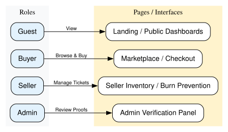
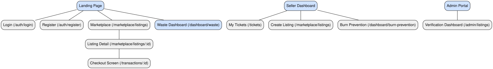
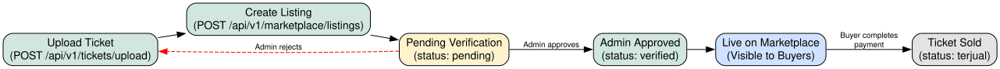
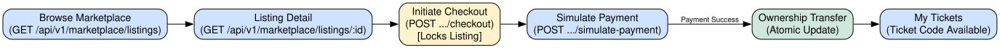
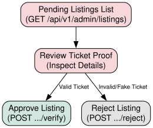
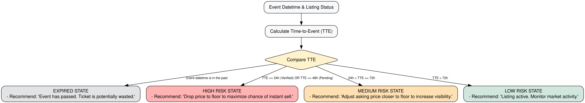
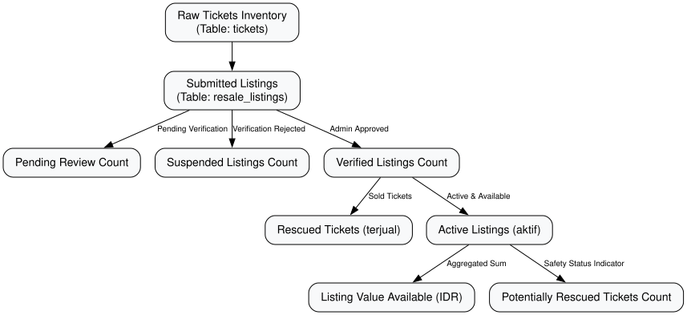
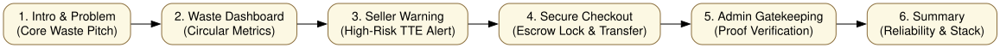

# TixLoop Frontend Visual System Map

This guide provides a visual map of the TixLoop application architecture, including user sitemaps, system logic flows, state transitions, and a feature ownership matrix. It is designed to help frontend developers build the client interface without deep-diving into backend PHP code.

---

## 1. Role Map

This map outlines the access structure for each user type, showing the screens they can access and the endpoints they interact with.

---

## 2. Frontend Sitemap

The following folder-like sitemap represents the target component routing and screen layout of the client application.

---

## 3. Seller Journey

This state diagram visualizes the life cycle of a seller's ticket, from initial upload to successful resale.

---

## 4. Buyer Journey

This state diagram visualizes the acquisition flow for a buyer, showing how row-level locks prevent double-selling during checkout.

---

## 5. Admin Journey

This diagram illustrates the two alternate workflows for an admin processing incoming secondary listings.

---

## 6. Burn Prevention Logic

The backend calculates Time-to-Event (TTE) and assigns risk levels dynamically. The frontend must parse these statuses to display appropriate color alerts and pricing recommendations.

---

## 7. Waste Dashboard Logic

This diagram visualizes how raw ticket inventory cascades into active listed value and sustainability metrics on the circular economy dashboard.

---

## 8. Feature Ownership Matrix

Use this matrix to track integration progress between frontend components and backend endpoints.

| Feature Area | Sub-Feature / API Endpoint | Backend Status | Recommended Frontend Page | Role |
| :--- | :--- | :---: | :--- | :--- |
| **Authentication** | Register User (`POST /auth/register`) | **Ready** | `/register` | Guest |
| | Login User (`POST /auth/login`) | **Ready** | `/login` | Guest |
| | Fetch Current Profile (`GET /auth/me`) | **Ready** | Core Context / Shell | User (All) |
| **Marketplace** | Browse Verified Listings (`GET /marketplace/listings`) | **Ready** | `/marketplace` | Guest, Buyer |
| | View Listing Details (`GET /marketplace/listings/:id`) | **Ready** | `/marketplace/:id` | Guest, Buyer |
| | Create Listing from Owned Ticket (`POST /marketplace/listings`) | **Ready** | `/seller/listings/create` | Seller |
| **Inventory** | Browse Owned Tickets (`GET /tickets`) | **Ready** | `/seller/tickets` | Seller |
| | Upload Ticket Asset (`POST /tickets/upload`) | **Ready** | `/seller/tickets/upload` | Seller |
| **Admin Panel** | Browse Pending Audits (`GET /admin/listings`) | **Ready** | `/admin/verification` | Admin |
| | Approve Reseller Listing (`POST /admin/listings/:id/verify`) | **Ready** | `/admin/verification` | Admin |
| | Reject Reseller Listing (`POST /admin/listings/:id/reject`) | **Ready** | `/admin/verification` | Admin |
| **Checkout** | Create Escrow Order (`POST /marketplace/listings/:id/checkout`) | **Ready** | `/checkout/:id` | Buyer |
| | Execute Payment Simulation (`POST /transactions/:id/simulate-payment`) | **Ready** | `/checkout/simulate` | Buyer |
| **Dashboards** | Circular Sustainability Waste Data (`GET /dashboard/waste`) | **Ready** | `/dashboard/waste` | Guest, Buyer |
| | Event Burn Prevention Risk Alerts (`GET /dashboard/burn-prevention`) | **Ready** | `/seller/burn-prevention` | Seller |

---

## 9. OLIVIA Demo Flow

Use this visual layout to coordinate the narrative sequence of the 5–7 minute OLIVIA demo.

